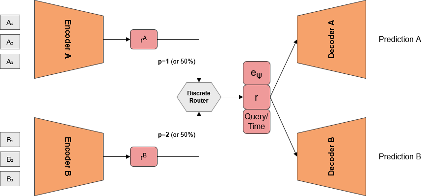
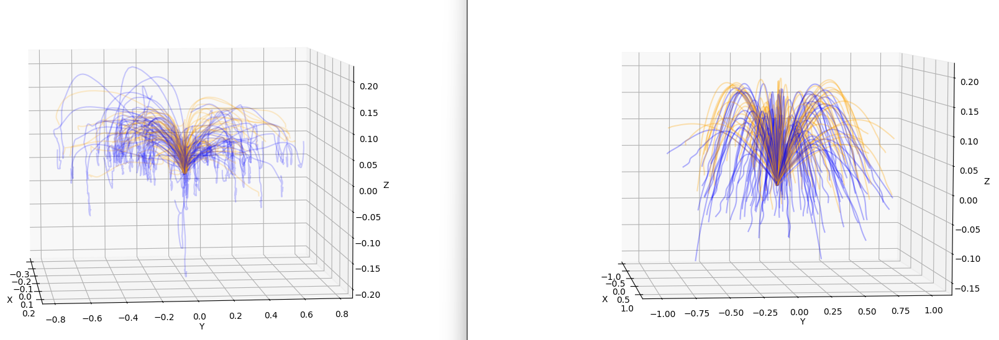
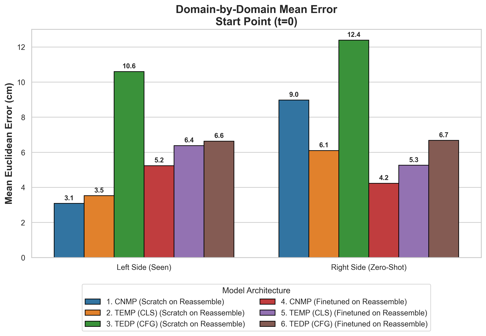
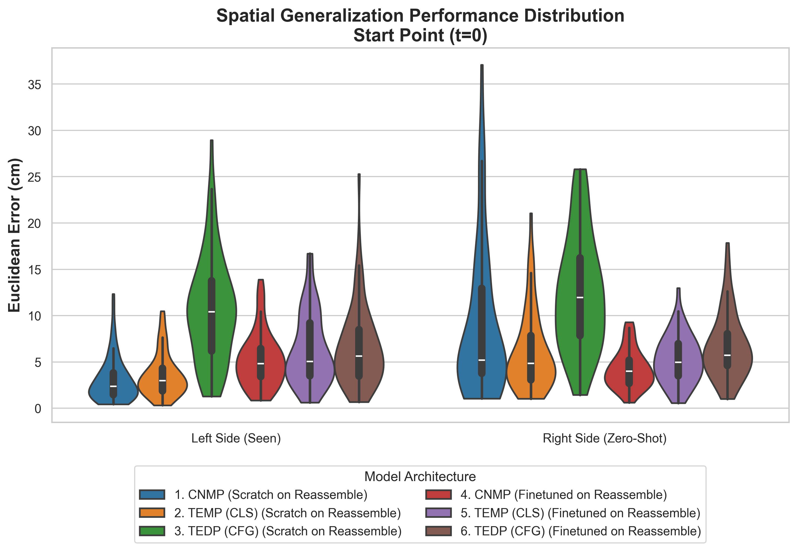

# Task Parameter Extrapolation in Task Inversion Applied on REASSEMBLE Dataset

[](https://pytorch.org/)
[](https://www.python.org/)
[]()

## Project Overview

This repository contains the PyTorch implementations of advanced generative models (**CNMP**, **TEMP**, and **TEDP**) applied to the **REASSEMBLE dataset**. 

The primary goal of this project is to achieve **Task Parameter Extrapolation** within the context of the robotic task inversion problem. Specifically, the framework is designed to:
1.  **Observe** an `Insert` trajectory (Forward Pass).
2.  **Generate** a corresponding `Place` trajectory (Inverse Pass) returning the object to its base.
3.  **Extrapolate to Unseen Tasks:** Generate valid, physically accurate inverse trajectories for entirely unseen spatial locations in the workspace by leveraging information learned from other tasks.

Initially, I relied on categorical object IDs for the task parameter. However, because 3D end-effector trajectories represent coarse macroscopic movements, specific object IDs lacked meaningful dynamic information. To achieve true task parameter extrapolation, I redefined the task parameter to be the continuous **Spatial Goal Configuration (X, Y socket coordinates)**. 

During training, models are exclusively trained on paired trajectories where the socket is located on the **Left Side** of the workspace. During inference, they are evaluated on their zero-shot ability to extrapolate the task parameter and generate inverse trajectories for sockets located on the **Right Side** of the workspace.

---

## Data Pipeline & Processing
* **Dataset:** [REASSEMBLE Dataset](https://tuwien-asl.github.io/REASSEMBLE_page/) (Multimodal: Pose, Joints, Force).
* **Trajectory Pairing:** Implemented the **Hungarian Algorithm** to minimize Euclidean distance between mismatched `Insert` end-points and `Place` start-points, creating valid semantic pairs from asynchronous data.


* **Geometric Relativization:**
    * *Insert:* Relativized to the trajectory start point ($t=0$).
    * *Place:* Relativized to the socket position (detected via Z-minima).


---

## Architecture Evolution & Diagnosing Bottlenecks


> *The Unified Dual-Encoder-Decoder Architecture. Observed sequence elements (𝐴1...𝐴𝑛 and 𝐵1...𝐵𝑛) are processed to
form a unified latent representation 𝑟, utilizing either average-pooling (CNMP) or [CLS] token extraction (TEMP/TEDP). The
latent vector 𝑟 is concatenated with the Task Parameter (𝑒𝛹) and a Query/Time condition (Target time for CNMP/TEMP;
Denoising step for TEDP) to generate the final trajectory prediction.*

To evaluate sequence generation capabilities, I expanded beyond the baseline CNMP model to include state-of-the-art architectures:

### 1. CNMP (Conditional Neural Movement Primitives - Baseline)
A neural architecture that processes continuous time and coordinate pairs to build a shared latent representation of the trajectory. Throughout my experiments, this baseline proved to be highly robust and yielded the lowest continuous errors for strict spatial precision tasks.

### 2. TEMP (Transformer Encoded Movement Primitive)
Replaces the encoder with a Transformer. 
* **The Conditioning Discovery:** Initial perturbation tests revealed a critical flaw: TEMP completely ignored spatial conditioning points, predicting the exact same trajectory regardless of input. I hypothesized that average pooling across masked tokens blurred the continuous spatial information. 
* **The Architectural Fix:** I tested an "unmasked pooling" variant which failed to solve the issue. I then engineered a variant replacing average pooling with a global `[CLS]` token, applying `src_key_padding_mask` natively to block attention to empty tokens, utilizing Pre-Layer Normalization, and lowering the learning rate. This successfully forced the Transformer to become responsive to spatial conditioning.

### 3. TEDP (Transformer Encoded Diffusion Policy)
Combines a Transformer encoder with a U-Net based diffusion model. 
* **Variant Experiments:** Similar to TEMP, early versions of TEDP struggled to respond to conditioning points. I experimented with several variants: using cross-attention pooling (which failed and increased error) and unmasked pooling (which also failed). 
* **The Final Architecture:** To resolve the conditioning bottleneck, I adopted the `[CLS]` token approach in the Transformer encoder (similar to the TEMP fix) and introduced **Classifier-Free Guidance (CFG)** to the diffusion process, which significantly improved continuous error values.

---

## Overcoming Data Scarcity: The Sim2Real Pipeline

Advanced generative architectures (Transformers/Diffusion) are notoriously data-hungry. The real-world REASSEMBLE dataset contains 860 total valid trajectories across 17 objects (obtained after performing forward-inverse trajectory pairing using 'Insert' and 'Place' high-level actions, matched according to the end point of the forward trajectory and the start point of the inverse trajectory). This limited sample size created a severe bottleneck for TEMP and TEDP.

To stabilize these models, I implemented a **Sim2Real Transfer Pipeline**:

1. **Synthetic Data Generation:** I developed a synthetic data generator using Bezier curves and Gaussian distributions to approximate the bulk of the trajectories, bounded by the global 3D ranges (X, Y, Z) observed in the physical data. I tested the complexity of this synthetic domain using a small sample set and observed that the error margins across all 3 architectures closely matched the errors on the real dataset.
2. **Macro-Physics Pre-Training:** I generated a massive pre-training dataset of **34,000 synthetic samples**. The models were supervised pre-trained on this dataset to learn generalized 3D spatial rules without memorizing dataset-specific noise.
3. **Real-World Fine-Tuning:** The pretrained models were then fine-tuned on the 860 real-world samples to adapt to real-life motions and mechanical noise.


> *REASSEMBLE (Left) vs Synthetic (Right) Datasets. Blue colored trajectories represent forward trajectories (Insert) while
Orange colored trajectories represent inverse trajectories (Place). To prevent clutter only 100 random trajectories across 5 objects are
plotted. Origin point (0, 0, 0) represents the start of forward and the end of inverse trajectories.*

---

## 📊 Extrapolation Results

Models trained *from scratch* performed well on the Left Side of the board but suffered high variances when tested on the Right Side. The **Sim2Real pipeline successfully improved Task Parameter Extrapolation**, drastically reducing errors in predicting the unseen extraction point (t=0 of the inverse trajectory).

| Architecture | Scratch Error (Unseen) | Finetuned Error (Unseen) | Improvement |
| :--- | :--- | :--- | :--- |
| **CNMP** | 9.0 cm | **4.2 cm** | **-53.3%** |
| **TEMP (CLS)** | 6.1 cm | **5.3 cm** | **-13.1%** |
| **TEDP (CFG)** | 12.4 cm | **6.7 cm** | **-45.9%** |

> **Observation:** Fine-tuned models showed slightly *higher* errors on the training side (Left, seen domain) compared to scratch models (e.g., CNMP increased from 3.1 cm to 5.2 cm). I believe this is because the models sacrificed minor seen-domain accuracy to retain a robust, generalized spatial prior, which ultimately improved inverse trajectory prediction performance during true extrapolation.

### Performance Distributions


> *Mean Euclidean Error at Start Point (t=0) of Inverse Trajectory. The Finetuned models
(red/purple/brown) maintain highly stable performance across both the Seen and Zero-Shot
domains, proving successful spatial generalization.*


> *Error Distribution. Note the severe variance (tall distributions) in scratch TEDP
and CNMP models on the right side (unseen domain), which is stabilized by the Sim2Real
pipeline.*

---

## Installation & Environment Setup

This project requires **two separate environments** due to dependency conflicts with the original REASSEMBLE dataset tools.

### 1. REASSEMBLE Environment (High Level Data Extraction)
- Use this environment for data extraction (i.e., "choose_high_level_action.py").
- Follow instructions from the REASSEMBLE repo to create "REASSEMBLE" conda environment.
- [https://github.com/TUWIEN-ASL/REASSEMBLE](https://github.com/TUWIEN-ASL/REASSEMBLE)

- **Note:** Once raw high level actions are extracted to .npy files (in "raw_high_level_actions" directory), you should switch back to the main "task-inversion" environment for all subsequent steps (pairing, training, etc.).

### 2. Main Environment (Preprocessing, Training, Evaluation)
Use this environment for all other tasks including data preprocessing, model training, and evaluation.

```bash
git clone <repository-url>
cd task-inversion
conda env create -f environment.yml
conda activate task-inversion
```

### 3. Download Data
* Download the REASSEMBLE dataset and place h5 files in the `data/original_reassemble_data` directory.

---

## Usage

### Data Preprocessing

Extract all action-object combinations from the Reassemble Dataset:

```bash
python preprocessing/choose_high_level_action.py
```

Process raw trajectory data and synchronize high-level actions (interpolation):

```bash
python preprocessing/process_high_level_action.py
```

Relativize trajectories and plot:

```bash
python preprocessing/plot_relative_values.py
```

Match and pair forward-inverse trajectories for task inversion:

```bash
python preprocessing/match_and_stack_trajectories.py
```

### Model Training
To train a model, run the master training script with the desired argparse options:

```bash
python model/train.py --model tedp_cfg --dataset reassemble
```

### Model Evaluation
To test a trained model, run the master evaluation script with the desired argparse options:

```bash
python model/evaluate.py --model tedp_cfg --dataset reassemble --run_id run_20260601_001323
```

### Conditioning Test
To test whether a trained model responds to perturbations in the given conditions or not:
```bash
python model/conditioning_perturbation_test --model tedp_cfg --dataset reassemble --run_id run_20260601_001323
```

### Visualizing Model Predictions
To visualize the inverse trajectories (seen + unseen domain) predicted by the trained models:
```bash
python model/visualize_predictions.py --num_plots 50
```

### Model Comparison Plots
To create violin, box and bar plots for comparing the performances of trained models:
```bash
python model/compare_models.py --config model/compare_config.json
```

## Project Structure

```
task-inversion/
├── assets/                         # Image assets for README
├── data/                           # Data directory
│   ├── original_reassemble_data/   # Raw H5 data files
│   ├── paired_trajectories/        # Matched trajectory pairs
│   ├── processed_high_level_actions/ # Preprocessed action data
│   ├── raw_high_level_actions/     # Raw action recordings
│   ├── warped_trajectories/        # Time-warped trajectories
│   └── plots/                      # Visualization outputs
├── model/                          # Neural network models
│   ├── dual_enc_dec_cnmp.py       # Main dual encoder-decoder model
│   ├── model_noisy_paired.py      # Noisy paired training model
│   ├── model_predict.py           # Inference utilities
│   ├── loss_utils.py              # Custom loss functions
│   ├── validate_model.py          # Model validation
│   ├── insert_place_square_round_peg/ # Peg insertion task model (task extrapolation)
│   ├── multiple_high_level_model/ # Multi-task model
│   └── single_high_level_model/   # Single task baseline
├── preprocessing/                  # Data preprocessing scripts
│   ├── process_high_level_action.py # Action data processing
│   ├── match_and_stack_trajectories.py # Trajectory pairing
│   ├── cluster_trajectories.py    # Trajectory clustering
│   ├── warp_matched_trajectories.py # Dynamic time warping
│   └── plot_*.py                  # Visualization scripts
└── REASSEMBLE/                     # Data I/O utilities
    └── io.py
```
